# Awesome Mac Admin Tools 

> A curated list of handy-dandy tools for Mac Admins.

Inspired by the [awesome](https://github.com/sindresorhus/awesome) list.

## Contents

- [Command-line tools](#command-line-tools)
- [Deployment](#deployment)
- [Helper Menus](#helper-menus)
- [Onboarding Experience](#onboarding-experience)
- [Productivity](#productivity)
- [Text Editing](#text-editing)
- [Utilities](#utilities)

---

## Command-line tools

### erase-install

> erase-install.sh is a script to download macOS full installers, and to reinstall, upgrade or erase macOS.

**Cost:** N/A

**Link:** [https://github.com/grahampugh/erase-install](https://github.com/grahampugh/erase-install)

### getmacosipsws.py

> Quick-and-dirty tool to download the macOS IPSW files currently advertised by Apple in the [https://mesu.apple.com/assets/macos/com_apple_macOSIPSW/com_apple_macOSIPSW.xml](https://mesu.apple.com/assets/macos/com_apple_macOSIPSW/com_apple_macOSIPSW.xml) feed.

**Cost:** N/A

**Link:** [https://github.com/munki/macadmin-scripts](https://github.com/munki/macadmin-scripts)

[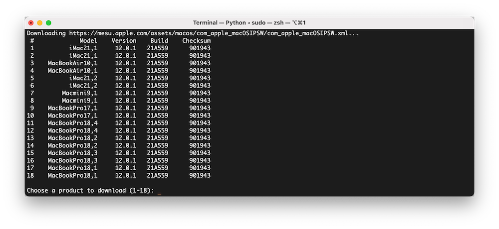](https://github.com/munki/macadmin-scripts)

### installinstallmacos.py

> Create disk images containing macOS Installer applications available via Apple's softwareupdate catalogs.

**Cost:** N/A

**Link:** [https://github.com/munki/macadmin-scripts](https://github.com/munki/macadmin-scripts)

[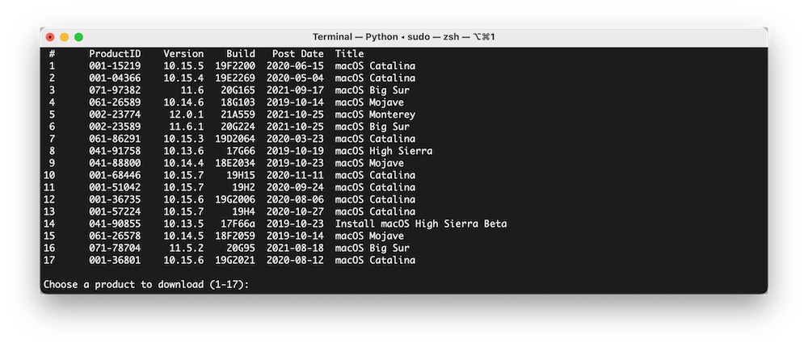](https://github.com/munki/macadmin-scripts)

### MIST - macOS Installer Super Tool

> A Mac command-line tool that automatically downloads macOS Installers/firmware.

**Cost:** N/A

**Link:** [https://github.com/ninxsoft/Mist](https://github.com/ninxsoft/Mist)

### moss

> A helper app for Hello IT to make building mobileconfig files easier.

**Cost:** N/A

**Link:** [https://github.com/WardsParadox/moss](https://github.com/WardsParadox/moss)

### Recategorizer

> Quickly recategorize policies and packages in Jamf Pro, and even more unused categories.

**Cost:** N/A

**Link:** [https://github.com/sheagcraig/Recategorizer](https://github.com/sheagcraig/Recategorizer)

### scriptorium

> A utility for managing the scripts in Jamf Pro. It provides backup, change tracking, and an easier edit process.

**Cost:** N/A

**Link:** [https://github.com/Honestpuck/scriptorium](https://github.com/Honestpuck/scriptorium)

[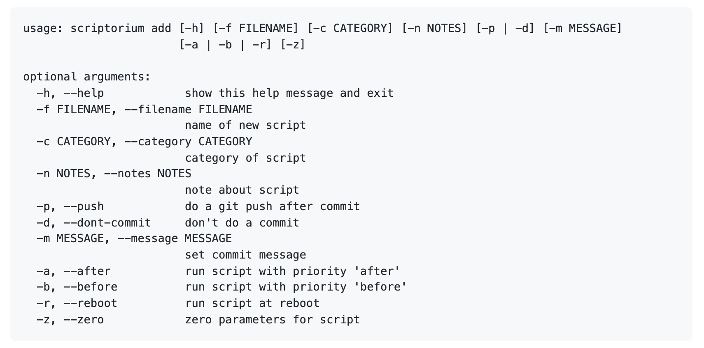](https://github.com/Honestpuck/scriptorium)

### S.U.P.E.R.M.A.N.

> S.U.P.E.R.M.A.N. (**S**oftware **U**pdate **P**olicy **E**nforcement (with) **R**ecursive **M**essaging **A**nd **N**otification) optimizes the macOS software upgrade and upgrade experience.

**Cost:** N/A

**Link:** [https://github.com/Macjutsu/super](https://github.com/Macjutsu/super)

### Stronghold

> Easily configure macOS security settings from the terminal.

**Cost:** N/A

**Link:** [https://github.com/alichtman/stronghold](https://github.com/alichtman/stronghold)

### vfuse

> A handy script that converts a never-booted DMG into a VMware Fusion VM.

**Cost:** N/A

**Link:** [https://github.com/chilcote/vfuse](https://github.com/chilcote/vfuse)

### swiftDialog

> swiftDialog is an open source admin utility for macOS written in SwiftUI that presents custom dialogs, displays informative messages or can be used as a form to request user input.

**Cost:** Free

**Link:** [https://github.com/swiftDialog/swiftDialog](https://github.com/swiftDialog/swiftDialog)

[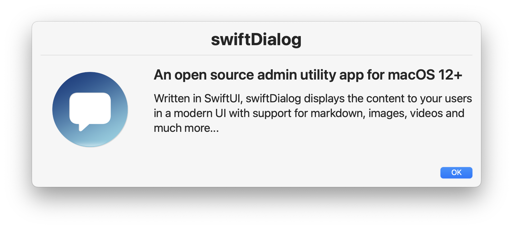](https://github.com/swiftDialog/swiftDialog)

## Deployment

### Apparency

> An application for inspecting application bundles, including code signing requirements, notarization, and included frameworks.

**Cost:** Free

**Link:** [https://www.mothersruin.com/software/Apparency/](https://www.mothersruin.com/software/Apparency/)

[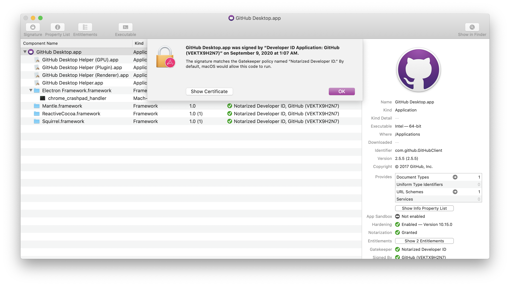](https://www.mothersruin.com/software/Apparency/)

### AutoPkg

> Automated third party package download and creation for deployment.

**Cost:** N/A

**Link:** [https://github.com/autopkg/autopkg](https://github.com/autopkg/autopkg)

### AutoPkgr

> GUI for AutoPkg, with click-to-add functionality of additional components.

**Cost:** N/A

**Link:** [https://github.com/lindegroup/autopkgr](https://github.com/lindegroup/autopkgr)

### Composer

> Jamf's in-house package creator tool. Builds pkgs and dmgs made for deployment with the Jamf Pro Suite, but pkgs built with Composer can be used with any management framework.

**Cost:** &#36; USD 99.95, otherwise included with the Jamf Pro Suite if a Jamf customer.

**Link:** [https://www.jamf.com/products/jamf-composer/](https://www.jamf.com/products/jamf-composer/)

### Low Profile

>A Mac utility to help inspect Apple Configuration Profile payloads.

**Cost:** N/A

**Link:** [https://github.com/ninxsoft/LowProfile](https://github.com/ninxsoft/LowProfile)

### munki-pkg

> munki-pkg is a simple tool for building packages. While it was developed for use with munki, it can be used to make pkgs that are deployable with any management framework.

**Cost:** N/A

**Link:** [https://github.com/munki/munki-pkg](https://github.com/munki/munki-pkg)

### Nudge

> Nudge strongly encourages running macOS updates and can be customized with profiles or local json files.

**Cost:** N/A

**Link:** https://github.com/macadmins/nudge

### Packages.app

> A free package creation tool. The gold standard of making your own custom installer packages.

**Cost:** Free

**Link:** [http://s.sudre.free.fr/Software/Packages/about.html](http://s.sudre.free.fr/Software/Packages/about.html)

### Payload-Free Package Creator

> An Automator application that quickly builds payload-free pkgs for deployment.

**Cost:** N/A

**Link:** [https://github.com/rtrouton/Payload-Free-Package-Creator](https://github.com/rtrouton/Payload-Free-Package-Creator)

### ProfileCreator

> macOS application to create configuration profiles.

**Cost:** N/A

**Link:** [https://github.com/ProfileCreator/ProfileCreator](https://github.com/ProfileCreator/ProfileCreator)

### Suspicious Package

> An application for inspecting the contents of macOS packages.

**Cost:** Free

**Link:** [https://www.mothersruin.com/software/SuspiciousPackage/](https://www.mothersruin.com/software/SuspiciousPackage/)

### Baseline

> An MDM agnostic zero touch or light touch solution for macOS. Fueled by swiftDialog and integrated with Installomator, run Packages, Scripts, and Installomator labels. Manage configurations using iMazing Profile Editor.

**Cost:** Free

**Link:** [https://github.com/secondsonconsulting/baseline](https://github.com/secondsonconsulting/baseline)

[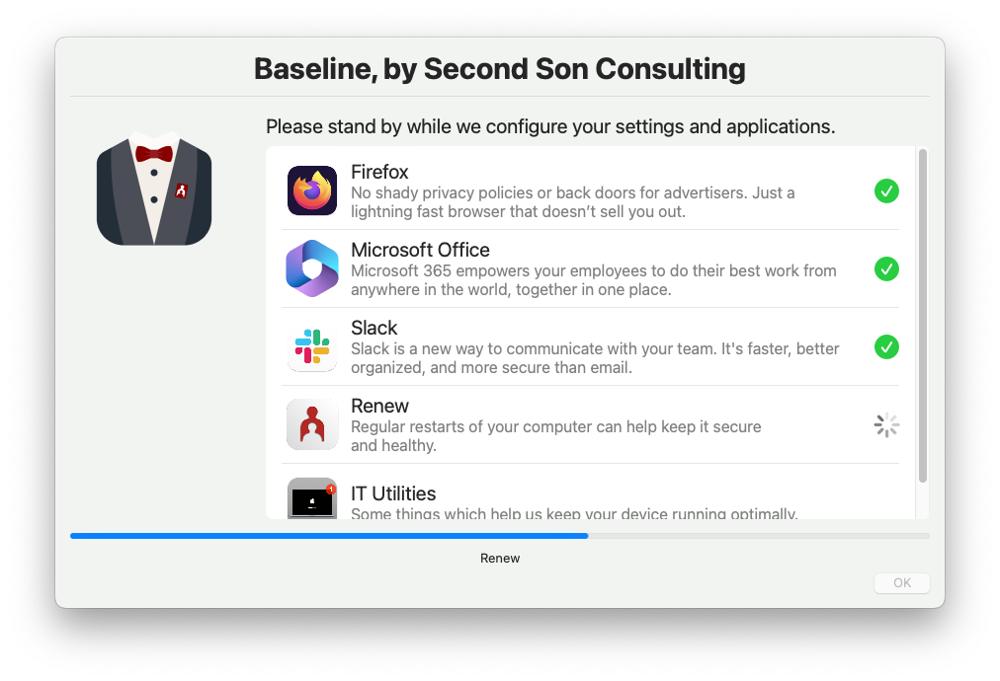](https://github.com/secondsonconsulting/baseline)

### Patchomator

> A management script for automating updates with Installomator.

**Price:** N/A

**Link:** [https://github.com/Mac-Nerd/patchomator](https://github.com/Mac-Nerd/patchomator)

[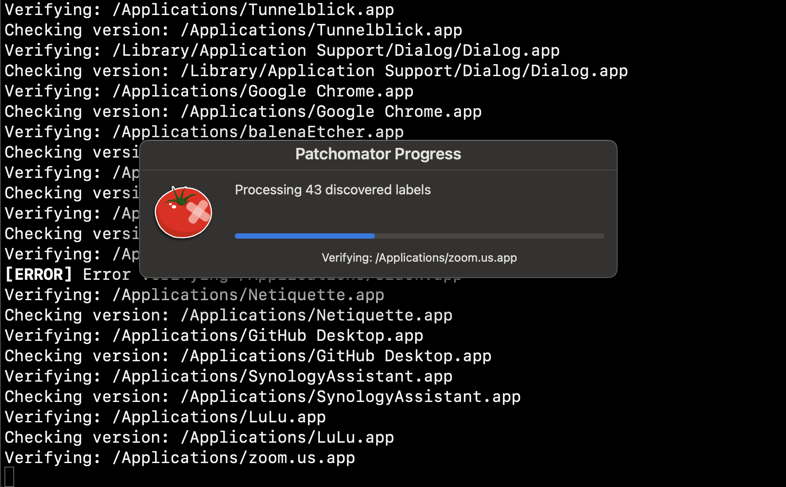]([http://url/to/toolinfo](https://github.com/Mac-Nerd/patchomator))

## Helper Menus

### Hello-IT

> A handy menubar application to get users in touch with IT and quickly get information and resources on their Mac.

**Cost:** N/A

**Link:** [https://github.com/ygini/Hello-IT](https://github.com/ygini/Hello-IT)

### MacDNA

> Customizable menubar that checks for hardware status, management framework status, and other handy information.

**Cost:** N/A

**Link:** [https://github.com/jhbush/Arek/tree/master/Development/MacDNA%20Menulet](https://github.com/jhbush/Arek/tree/master/Development/MacDNA%20Menulet)

### NoMAD

> The functionality you want from a Mac bound to Active Directory without having to actually bind to AD. (Make sure you [check out this NoMAD updater](https://github.com/jamfit/NoMAD-Installer) as well.)

**Cost:** Free, Jamf Connect (pro version) pricing information can be found [here](https://www.jamf.com/products/jamf-connect/)

**Link:** [https://nomad.menu/products/#nomad](https://nomad.menu/products/#nomad)

### Pareto Security

> Automatically audit your Mac for basic security hygiene.

**Price:** N/A

**Link:** [https://paretosecurity.app/](https://paretosecurity.app/)

[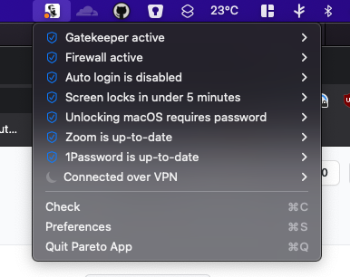](https://paretosecurity.app/)

### SupportApp

> The Support app is a macOS menu bar app built for organizations to help users and helpdesks to see basic diagnostic information at a glance and easily customizable with a configuration profile.

**Cost:** Free

**Link:** [https://github.com/root3nl/SupportApp](https://github.com/root3nl/SupportApp)

## Onboarding Experience

### ADEPT

> A setup/splash screen for DEP and user-initiated Jamf Pro enrollments. Detailed documentation highlights how to work with the application in Xcode to customize it for your organization's needs.

**Cost:** Free to use, paid installation/customization services available.

**Link:** [https://git.tramscloud.co.uk/projects/XCOD/repos/adept/browse](https://git.tramscloud.co.uk/projects/XCOD/repos/adept/browse)

### DEP Notify

> A lightweight notification app designed to let users know what's happening during DEP enrollment.

**Cost:** N/A

**Link:** [https://gitlab.com/Mactroll/DEPNotify](https://gitlab.com/Mactroll/DEPNotify)

## Jamf Setup Manager

> There are many enrollment progress tools available for Mac admins, each with their own strengths. Jamf Setup Manager approaches the problem from the perspective of an IT service provider. It runs over Setup Assistant before a user is created so it won't interfere with MDM-capable user or the secure token flow for FileVault. You can control which policies and installations Setup Manager runs with a configuration profile.

**Cost:** N/A

**Link:** [https://github.com/Jamf-Concepts/Setup-Manager](https://github.com/Jamf-Concepts/Setup-Manager)

### Octory

> Octory is a highly customizable and elegant macOS application to onboard, support and watch over your users on their Mac.

**Cost:** [Free](https://www.octory.io/pricing), with Pro pricing/options available

**Link:**

## Productivity

### Google Keep

> Virtual sticky notes, lists, photos, and audio.

**Cost:** Included with Gmail accounts.

**Link:** [https://www.google.com/keep/](https://www.google.com/keep/)

### Slack

> Team chat and productivity client. Anyone can create a free team with ten integrations. (Join the [MacAdmins Slack](https://macadmins.herokuapp.com/)!)

**Cost:** Free teams with limited capabilities, additonal pricing can be found [here](https://slack.com/pricing)

**Link:** [https://slack.com/downloads/osx](https://slack.com/downloads/osx)

### Taskade

> Create simple and minimal checklists, notes and outlines. Taskade is collaborative and syncs in real-time across all devices. Free, browser-based and mobile app interface.

**Cost:** Free, with paid features available.

**Link:** [https://taskade.com/](https://taskade.com/)

### Trello

> Use Trello's boards, lists, and cards to organize and prioritize your projects. Free, browser-based and mobile app interface.

**Cost:** Free, with paid features available.

**Link:** [https://trello.com/](https://trello.com/)

## Text Editing

### BBEdit

> Clean and simple HTML & text editor, made by Bare Bones Software.

**Cost:** USD &#36;49.99 (direct download or via Mac App Store)

**Link:** [https://www.barebones.com/products/bbedit/](https://www.barebones.com/products/bbedit/)

### CodeLobster

> Free cross-platform editor

**Cost:** free (plug-ins are paid)

**Link:** [https://codelobster.com/](https://codelobster.com/)

[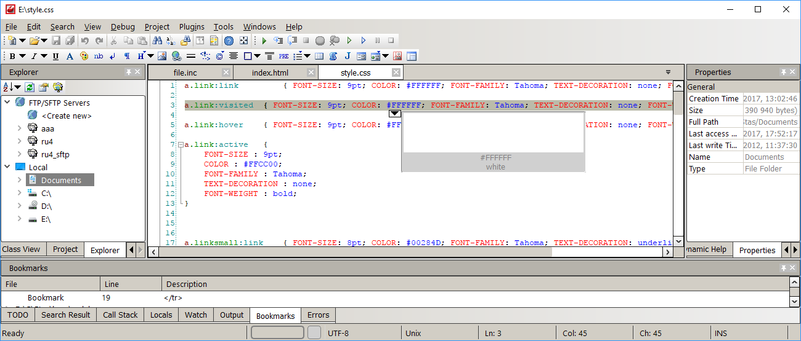](https://codelobster.com/)

### MacDown

> An open source markdown editor for macOS.

**Cost:** Free

**Link:** [https://macdown.uranusjr.com/](https://macdown.uranusjr.com/)

### Nova

> Nova is a new, fast, and flexible text editor, with all the features like smart autocomplete, multiple cursors, a Minimap, editor overscroll, tag pairs and brackets, and way, way more.

**Cost:** USD &#36;99.99 + tax (includes one year of updates and new features)

**Link:** [https://nova.app/](https://nova.app/)

### Sublime Text

> A high performance, cross-platform text editor.

**Cost:** USD &#36;80 to buy, free to evaluate.

**Link:** [https://www.sublimetext.com/](https://www.sublimetext.com/)

### Visual Studio Code

> Microsoft's source code editor in a lightweight, open source, cross-platform application.

**Cost:** Free

**Link:** [https://code.visualstudio.com/](https://code.visualstudio.com/)

### Xcode

> Apple's integrated development environment (IDE) containing a suite of software development tools developed by Apple for developing software used by Apple hardware.

**Cost:** Free with an Apple ID.

**Link:** [https://itunes.apple.com/us/app/xcode/id497799835?mt=12](https://itunes.apple.com/us/app/xcode/id497799835?mt=12)

### Coderunner 4

> A lightweight, multi-language programming text editor and IDE for macOS.

**Cost:** 19.99. Included with SetApp

**Link:** [https://coderunnerapp.com/download](https://coderunnerapp.com/download)

## Utilities

### Amphetamine

> A caffeine replacement that prevents your Mac from sleeping on demand.

**Cost:** Free in the Mac App Store

**Link:** [https://itunes.apple.com/app/amphetamine/id937984704?mt=12](https://itunes.apple.com/app/amphetamine/id937984704?mt=12)

### AppCleaner

> A small application which allows you to thoroughly uninstall unwanted apps.

**Cost:** Free

**Link:** [https://freemacsoft.net/appcleaner/](https://freemacsoft.net/appcleaner/)

### Escrow Buddy

> An authorization plugin that helps MDM administrators regenerate and escrow FileVault recovery keys.

**Cost:** Free

**Link:** [https://github.com/macadmins/escrow-buddy](https://github.com/macadmins/escrow-buddy)

### Giphy Capture

> Easily capture GIFs from your Mac, great for documentation.

**Cost:** Free from the Mac App Store.

**Link:** [https://itunes.apple.com/us/app/giphy-capture-the-gif-maker/id668208984?mt=12](https://itunes.apple.com/us/app/giphy-capture-the-gif-maker/id668208984?mt=12)

### Icons.app

> Icons.app is an application for macOS which enables you to create graphics files in PNG format, for use with management tools like Jamf Software's Jamf Pro or the open source Munki software installation tool.

**Cost:** N/A

**Link:** [https://github.com/SAP/macOS-icon-generator](https://github.com/SAP/macOS-icon-generator)

### Jamf Compliance Editor

> Jamf Compliance Editor is a tool that provides macOS system administrators with an easy way to establish and manage compliance baselines on their fleet of macOS devices. This tool is built on the foundations of the [macOS Security Compliance Project](https://github.com/usnistgov/macos_security), hosted by the United States government agency, NIST, in their Github repo.

**Cost:** N/A

**Link:** [https://trusted.jamf.com/docs/establishing-compliance-baselines](https://trusted.jamf.com/docs/establishing-compliance-baselines)

[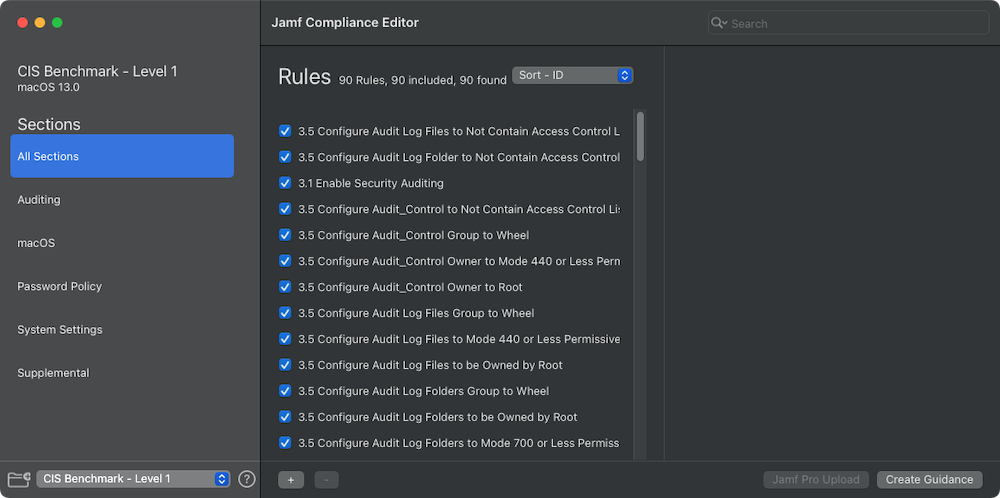](https://trusted.jamf.com/docs/establishing-compliance-baselines)

### Jamf Migrator

> A tool to migrate data granularly between Jamf Pro servers.

**Cost:** N/A

**Link:** [https://github.com/jamf/JamfMigrator](https://github.com/jamf/JamfMigrator)

### macOS Security Compliance Project

> The macOS security compliance project is an open source effort to provide a programmatic approach to generating security guidance. This project can be used to create customized security baselines of technical security controls by leveraging a library of rules which are mapped to compliance requirements in existing security guides or used to develop customized guidance.

**Cost:** N/A

**Link:** [https://github.com/usnistgov/macos_security](https://github.com/usnistgov/macos_security)

[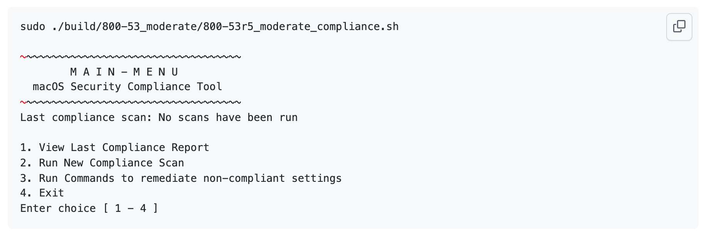](https://github.com/usnistgov/macos_security)

### The MUT

> The MUT is a native macOS application written in Swift which allows Jamf admins to make mass updates to attributes (such as username, asset tag, or extension attribute) of their devices and users in Jamf.

**Cost:** Free

**Link:** [https://apps.apple.com/us/app/the-mut/id1133234759](https://apps.apple.com/us/app/the-mut/id1133234759)

[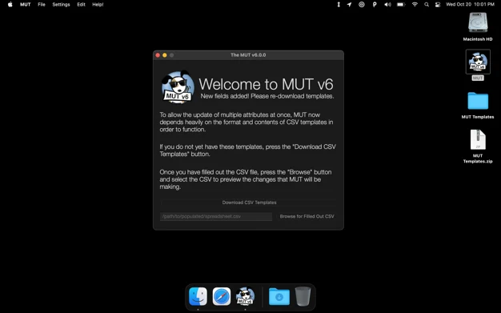](https://apps.apple.com/us/app/the-mut/id1133234759)

### Particulars

> Particulars displays system information as an overlay to your Mac wallpaper, as a Siri Shortcut, or a via command line.   In wallpaper mode, you choose the position and theme of the overlay.  You can choose to display any or all of: computer name, model name & identifier, serial number, CPU, GPU, RAM, OS version, Darwin version, current user, uptime, disk space, and network configuration.  Available via Mac App Store, and also offers a mass deployment .PKG for IT administrators.

**Cost:** Free (developer accepts donations)

**Link:** [Main Site (https://particulars.app)](https://particulars.app), or [Mac App Store](https://apps.apple.com/us/app/particulars/id885120167?ls=1&mt=12).

### Postman

> Postman is an API platform for building and using APIs. The Postman desktop app provides a simple way to interact with an API.

**Cost:** Free, with paid options

**Link:** [https://www.postman.com/downloads/](https://www.postman.com/downloads/)

### PPPC-Utility

> PPPC Utility is a macOS (10.15 and newer) application for creating configuration profiles containing the Privacy Preferences Policy Control payload for macOS.

**Cost:** Free

**Link:** [https://github.com/jamf/PPPC-Utility](https://github.com/jamf/PPPC-Utility)

### Prune

> Prune is a handy app that looks for unused items in a Jamf Pro server and makes them easy to identify and remove.

**Cost:** Free

**Link:** [https://github.com/BIG-RAT/Prune](https://github.com/BIG-RAT/Prune)

### Rectangle

> Move and resize windows in macOS using keyboard shortcuts or snap areas.

**Cost:** Free

**Link:** [https://rectangleapp.com/](https://rectangleapp.com/)

### Script2Pkg

> Helps with the process of creating payload-free installer packages.

**Cost:** N/A

**Link:** [https://github.com/SAP/script-to-package-tool-for-macos](https://github.com/SAP/script-to-package-tool-for-macos)

### SOFA

> SOFA (**S**imple **O**rganized **F**eed for **A**pple Software Updates) supports MacAdmins by efficiently tracking and surfacing information on updates for macOS and iOS. It consists of a machine-readable feed and user-friendly web interface, providing continuously up-to-date information on XProtect data, OS updates, and the details bundled in those releases.

**Cost:** N/A

**Link:** [https://sofa.macadmins.io/](https://sofa.macadmins.io/)

### sus-inspector

> Inspect Apple macOS software updates.

**Cost:** N/A

**Link:** [https://github.com/hjuutilainen/sus-inspector](https://github.com/hjuutilainen/sus-inspector)

### umad

> A Professional Tool to help users with getting pre-existing devices enrolled into MDM.

**Cost:** N/A

**Link:** [https://github.com/macadmins/umad](https://github.com/macadmins/umad)

### Yo

> Custom user notifications with Swift.

**Cost:** N/A

**Link:** [https://github.com/sheagcraig/yo](https://github.com/sheagcraig/yo)

### ProfileCreator

> A macOS app to create standard & customized configuration profiles & plists.

**Cost:** N/A

**Link:** [https://github.com/ProfileCreator/ProfileCreator](https://github.com/ProfileCreator/ProfileCreator)

### iMazing Profile Editor

**Cost:** Free

**Link:** [https://imazing.com/profile-editor](https://imazing.com/profile-editor)

> iMazing Profile Editor lets you create, edit, and sign profiles for macOS and iOS devices without coding XML files. You can customize the app, use community-compiled manifests, and export to MDM-compatible .plist files.

[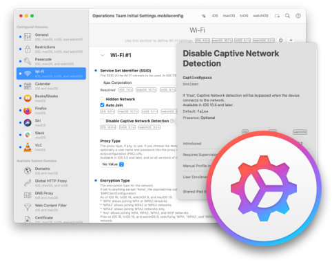](https://imazing.com/profile-editor)

---

## License

To the extent possible under law, [Emily Kausalik](https://twitter.com/emilyooo) has waived all copyright and related or neighboring rights to this work.
