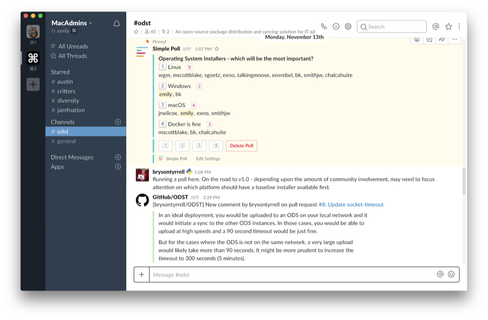

# Awesome Mac Admin Tools 

> A curated list of handy-dandy tools for Mac Admins.

Inspired by the [awesome](https://github.com/sindresorhus/awesome) list.

## Table of Contents

- [Deployment](#deployment)
- [Provisioning](#provisioning)
- [Text Editing](#text-editing)
- [Productivity](#productivity)
- [Power ups](#power-ups)

---

## Deployment

### Packages.app

> A free package creation tool. The gold standard of making your own custom installer packages.

### munki-pkg

> munki-pkg is a simple tool for building packages. While it was developed for use with munki, it can be used to make pkgs that are deployable with any management framework.

### AutoPkg

> Automated third party package download and creation for deployment.

### AutoPkgr

> GUI for AutoPkg, with click-to-add functionality of additional components

### AutoDMG

> Create deployable system images from macOS installers.*

### Suspicious Package

> An application for inspecting the contents of macOS packages.

### AutoCasperNBI

> Automate the creation of NetBoot images (NBIs) for use with Jamf Imaging.*

### Composer

> Jamf's in-house package creator tool. Builds pkgs and dmgs made for deployment with the Jamf Pro Suite, but pkgs built with Composer can be used with any management framework.

### Payload-Free Package Creator

> An Automator application that quickly builds payload-free pkgs for deployment.

## Provisioning

### Splash Buddy

> A customizable onboarding app designed to work with Jamf Pro and DEP.

### DEP Notify

> A lightweight notification app designed to let users know what's happening during DEP enrollment.

### ADEPT

> A setup/splash screen for DEP and user-initiated Jamf Pro enrollments. Detailed documentation highlights how to work with the application in Xcode to customize it for your organization's needs.

## Text Editing

### Atom

> An free, open source, hackable text editor.

### Sublime Text

> A high performance, cross-platform text editor.

### Xcode

> Apple's integrated development environment (IDE) containing a suite of software development tools developed by Apple for developing software used by Apple hardware. Free with an Apple ID.

### BBEdit

> Clean and simple HTML & text editor, made by Bare Bones Software. $49.99 at their site, or in the Mac App Store.

### MacDown

> An open source markdown editor for macOS.

### Visual Studio Code

> Microsoft's source code editor in a lightweight, open source, cross-platform application.

## Productivity

### Slack

> Team chat and productivity client. I mean, you know what Slack is. Anyone can create a free time with ten integrations. (Join the [MacAdmins Slack](https://macadmins.herokuapp.com/)!) There are over 15k users in the MacAdmins Slack. Drink from the firehose and get answers from the biggest hivemind of Apple-centric IT folks in the universe.

### Slack Calls

> Slack recently integrated Screenhero into the Slack client. Easily call colleagues with video chat and screensharing from within a Slack team.

### Trello

> Use Trello's boards, lists, and cards to organize and prioritize your projects. Free, browser-based and mobile app interface. And it integrates with Slack (see above)!

### Google Keep

> Virtual sticky notes, lists, photos, and audio. Included with Gmail accounts.

### LastPass

> LastPass stores your passwords and makes it easy to auto-fill and quickly sign into webapps without retyping your credentials. It also helps generate new passwords and warns you when use the same password for different services.

## Power Ups

### Spruce

> Works with your Jamf server to identify objects not currently being used, out of date, or are generally "crufty".

### Recategorizer

> Quickly recategorize policies and packages in Jamf Pro, and even more unused categories.

### vfuse

> A handy script that converts a never-booted DMG into a VMware Fusion VM.

### Jamf Migrator

> A tool to migrate data granularly between Jamf Pro servers.

### Giphy Capture

> Easily capture GIFs from your Mac, great for documentation.

### AppCleaner

> A small application which allows you to thoroughly uninstall unwanted apps.

### Wallcat

> Rotates through beautiful new desktop wallpapers

### Amphetamine

> A caffeine replacement that prevents your Mac from sleeping.

### NoMAD

> The functionality you want from a Mac bound to Active Directory without having to actually bind to AD. (Make sure you [check out this NoMAD updater](https://github.com/jamfit/NoMAD-Installer) as well.)

### Hello-IT

> A handy menubar application to get users in touch with IT and quickly get information and resources on their Mac.

### moss

> A helper app for Hello IT to make building mobileconfig files easy!

### MacDNA

> Customizable menubar that checks for hardware status, management framework status, and other handy information.

&ast; *[Is imaging dead](http://isimagingdead.com/)?* 
---

## License

To the extent possible under law, [Emily Kausalik](https://twitter.com/emilyooo) has waived all copyright and related or neighboring rights to this work.
