# Awesome Mac Admin Tools 

> A curated list of handy-dandy tools for Mac Admins.

Inspired by the [awesome](https://github.com/sindresorhus/awesome) list.

## Contents

- [Deployment](#deployment)
- [Onboarding Experience](#onboarding-experience)
- [Text Editing](#text-editing)
- [Helper Menus](#helper-menus)
- [Productivity](#productivity)
- [Power ups](#power-ups)

---

## Deployment

### Packages.app

> A free package creation tool. The gold standard of making your own custom installer packages.

**Cost:** Free

**Link:** [http://s.sudre.free.fr/Software/Packages/about.html](http://s.sudre.free.fr/Software/Packages/about.html)

[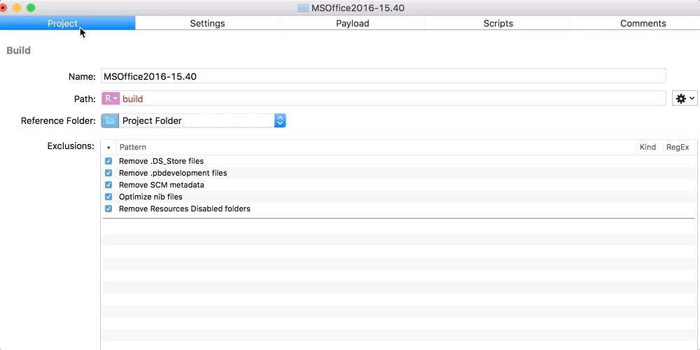](http://s.sudre.free.fr/Software/Packages/about.html)

### Composer

> Jamf's in-house package creator tool. Builds pkgs and dmgs made for deployment with the Jamf Pro Suite, but pkgs built with Composer can be used with any management framework.

**Cost**: USD $99.95, otherwise included with the Jamf Pro Suite if a Jamf customer.

**Link:** [https://www.jamf.com/products/jamf-composer/](https://www.jamf.com/products/jamf-composer/)

[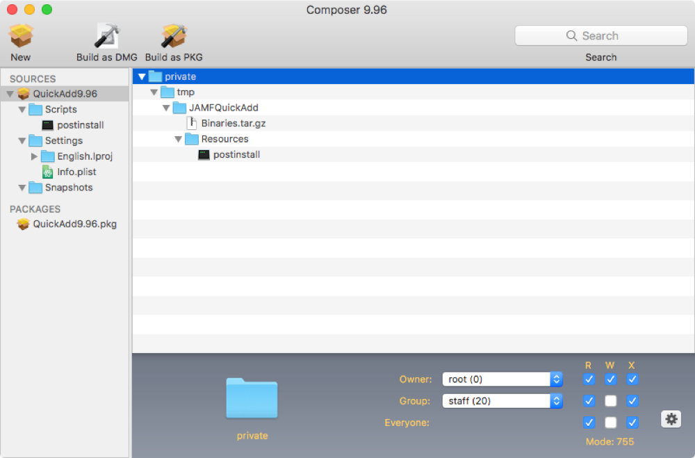](https://www.jamf.com/products/jamf-composer/)

### Payload-Free Package Creator

> An Automator application that quickly builds payload-free pkgs for deployment.

**Cost:** N/A

**Link:** [https://github.com/rtrouton/Payload-Free-Package-Creator](https://github.com/rtrouton/Payload-Free-Package-Creator)

[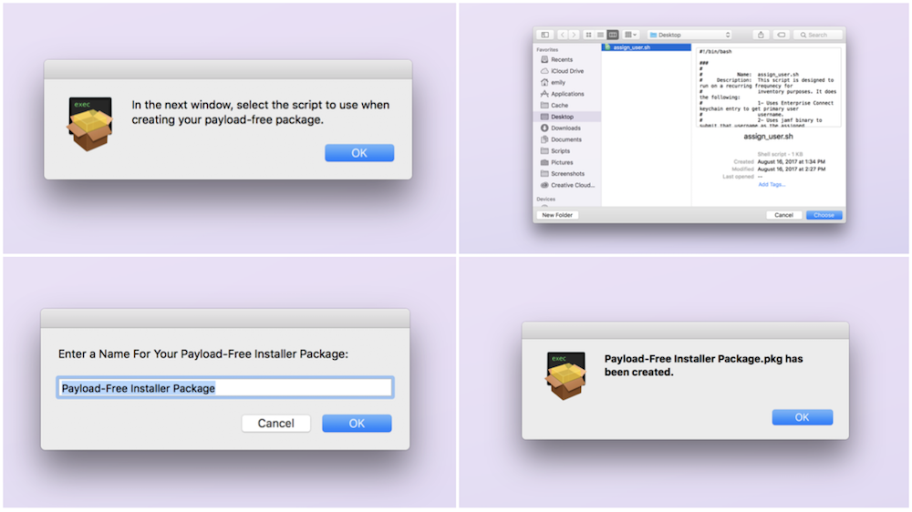](https://github.com/rtrouton/Payload-Free-Package-Creator)

### munki-pkg

> munki-pkg is a simple tool for building packages. While it was developed for use with munki, it can be used to make pkgs that are deployable with any management framework.

**Cost:** N/A

**Link:** [https://github.com/munki/munki-pkg](https://github.com/munki/munki-pkg)

[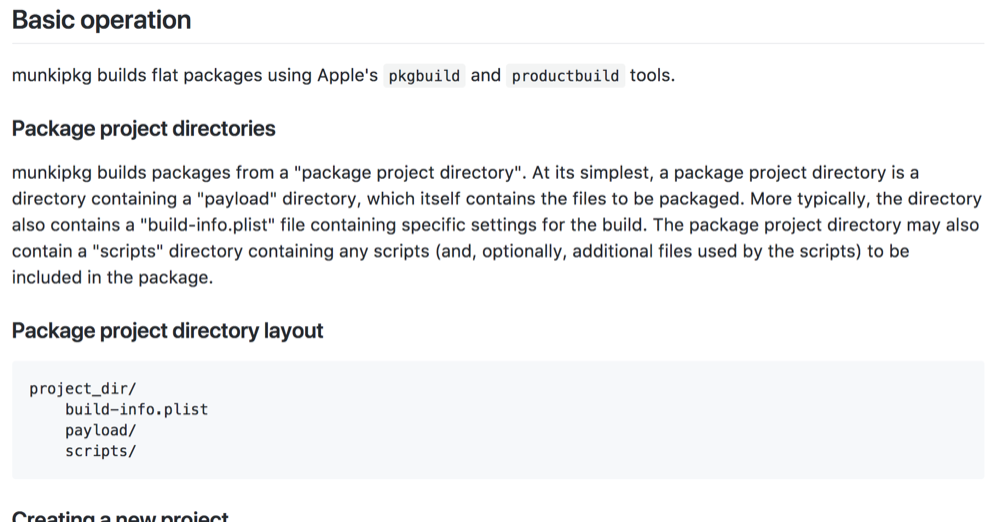](https://github.com/munki/munki-pkg)

### AutoPkg

> Automated third party package download and creation for deployment.

**Cost:** N/A

**Link:** [https://github.com/autopkg/autopkg](https://github.com/autopkg/autopkg)

[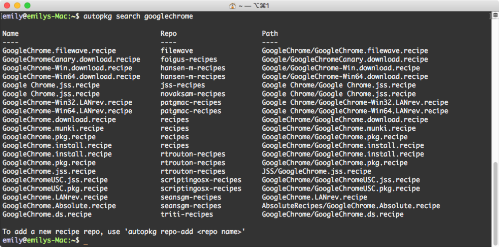](https://github.com/autopkg/autopkg)

### AutoPkgr

> GUI for AutoPkg, with click-to-add functionality of additional components.

**Cost:** N/A

**Link:** [https://github.com/lindegroup/autopkgr](https://github.com/lindegroup/autopkgr)

[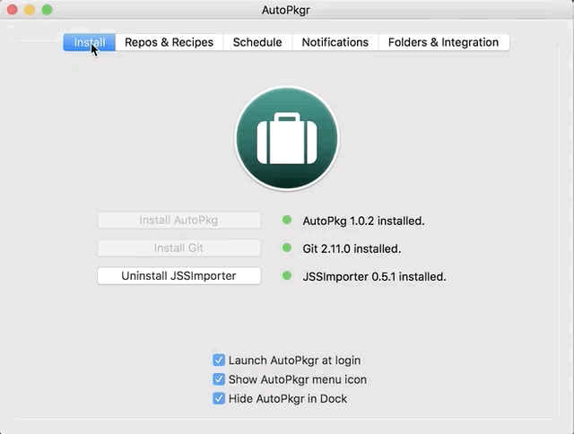](https://github.com/lindegroup/autopkgr)

### Suspicious Package

> An application for inspecting the contents of macOS packages.

**Cost:** Free

**Link:** [http://www.mothersruin.com/software/SuspiciousPackage/](http://www.mothersruin.com/software/SuspiciousPackage/)

### AutoDMG

> Create deployable system images from macOS installers.[*](http://isimagingdead.com/)

**Cost:** N/A

**Link:** [https://github.com/MagerValp/AutoDMG](https://github.com/MagerValp/AutoDMG)

### AutoCasperNBI

> Automate the creation of NetBoot images (NBIs) for use with Jamf Imaging.[*](#-is-imaging-dead-)

**Cost:** N/A

**Link:** [https://github.com/macmule/AutoCasperNBI](https://github.com/macmule/AutoCasperNBI)

[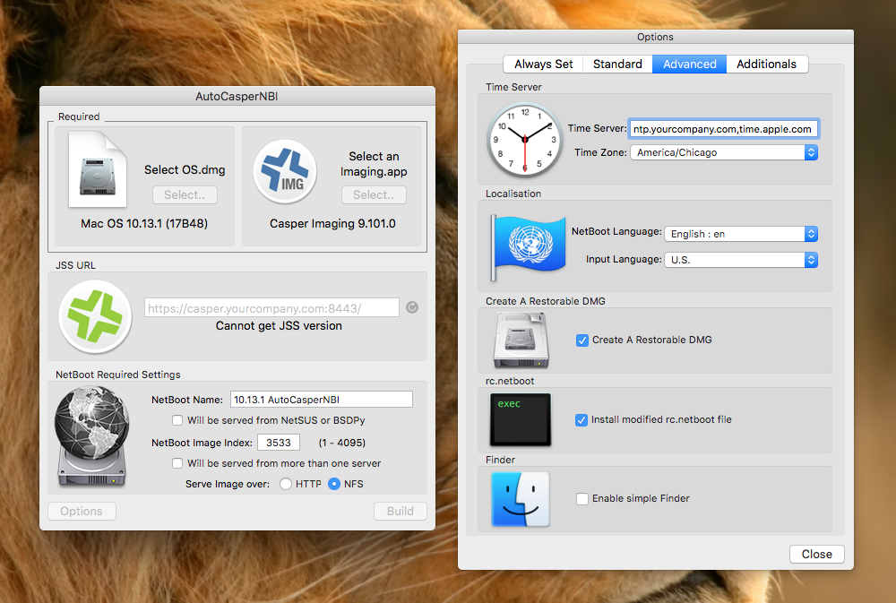](https://github.com/macmule/AutoCasperNBI)

## Onboarding Experience

### Splash Buddy

> A customizable onboarding app designed to work with Jamf Pro and DEP.

**Cost:** N/A

**Link:** [https://github.com/Shufflepuck/SplashBuddy](https://github.com/Shufflepuck/SplashBuddy)

[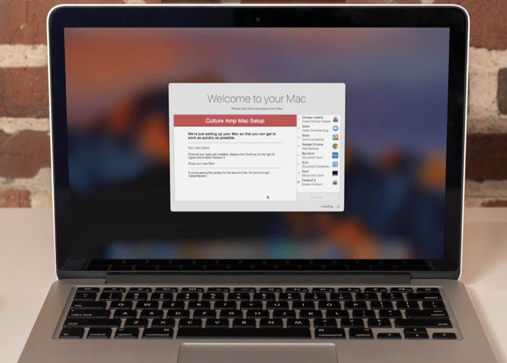](https://github.com/Shufflepuck/SplashBuddy)

### ADEPT

> A setup/splash screen for DEP and user-initiated Jamf Pro enrollments. Detailed documentation highlights how to work with the application in Xcode to customize it for your organization's needs.

**Cost:** Free to use, paid installation/customization services available.

**Link:** [https://git.tramscloud.co.uk/projects/XCOD/repos/adept/browse](https://git.tramscloud.co.uk/projects/XCOD/repos/adept/browse)

[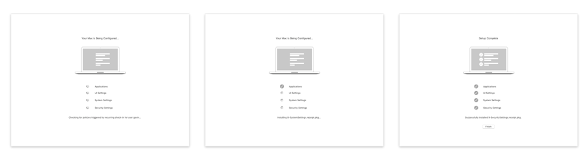](https://git.tramscloud.co.uk/projects/XCOD/repos/adept/browse)

### DEP Notify

> A lightweight notification app designed to let users know what's happening during DEP enrollment.

**Cost:** N/A

**Link:** [https://gitlab.com/Mactroll/DEPNotify](https://gitlab.com/Mactroll/DEPNotify)

[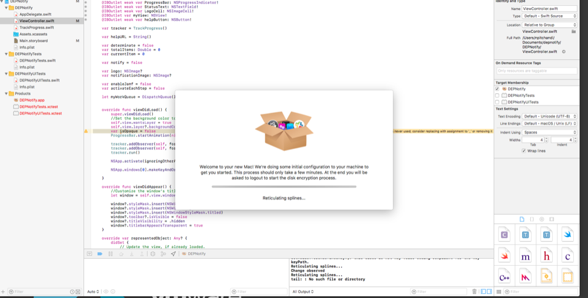](https://gitlab.com/Mactroll/DEPNotify)

## Helper Menus

### NoMAD

> The functionality you want from a Mac bound to Active Directory without having to actually bind to AD. (Make sure you [check out this NoMAD updater](https://github.com/jamfit/NoMAD-Installer) as well.)

**Cost:** Free, Jamf Connect (pro version) pricing information can be found [here](https://www.jamf.com/products/jamf-connect/)

**Link:** [https://nomad.menu/products/#nomad](https://nomad.menu/products/#nomad)

[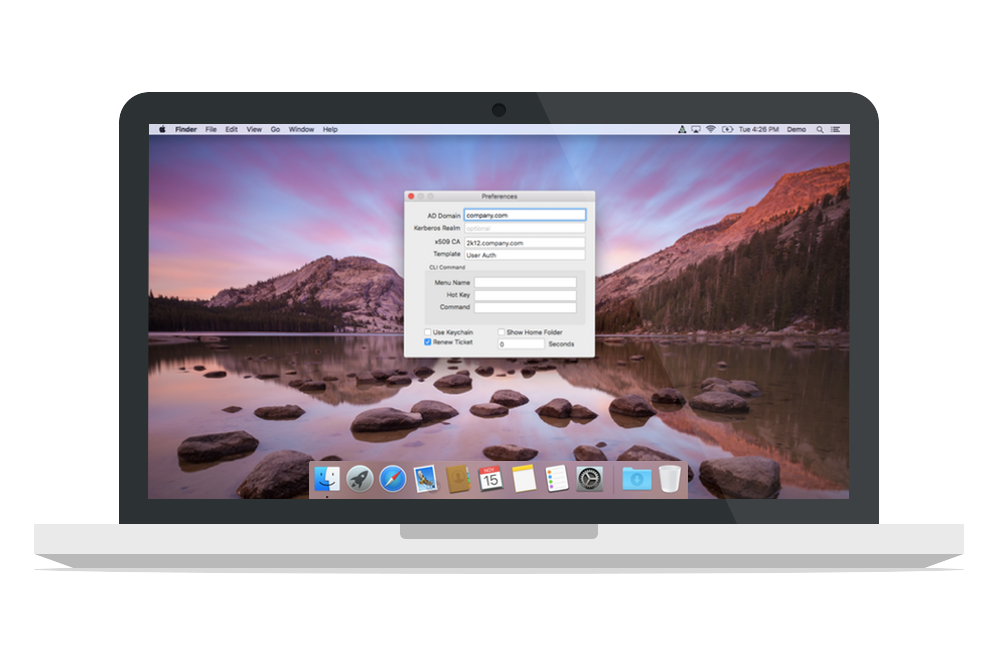](https://nomad.menu/products/#nomad)

### Hello-IT

> A handy menubar application to get users in touch with IT and quickly get information and resources on their Mac.

**Cost:** N/A

**Link:** [https://github.com/ygini/Hello-IT](https://github.com/ygini/Hello-IT)

[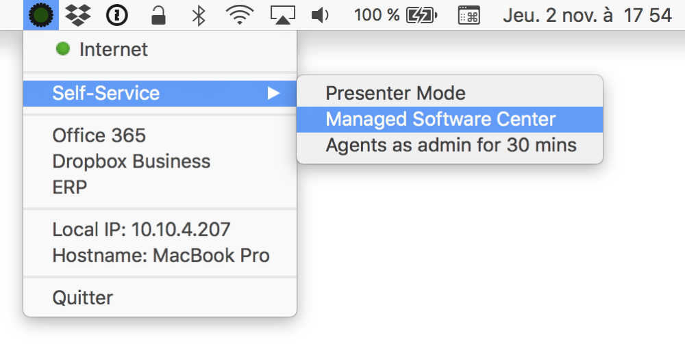](https://github.com/ygini/Hello-IT)

### moss

> A helper app for Hello IT to make building mobileconfig files easier.

**Cost:** N/A

**Link:** [https://github.com/PaperFixie/moss](https://github.com/PaperFixie/moss)

[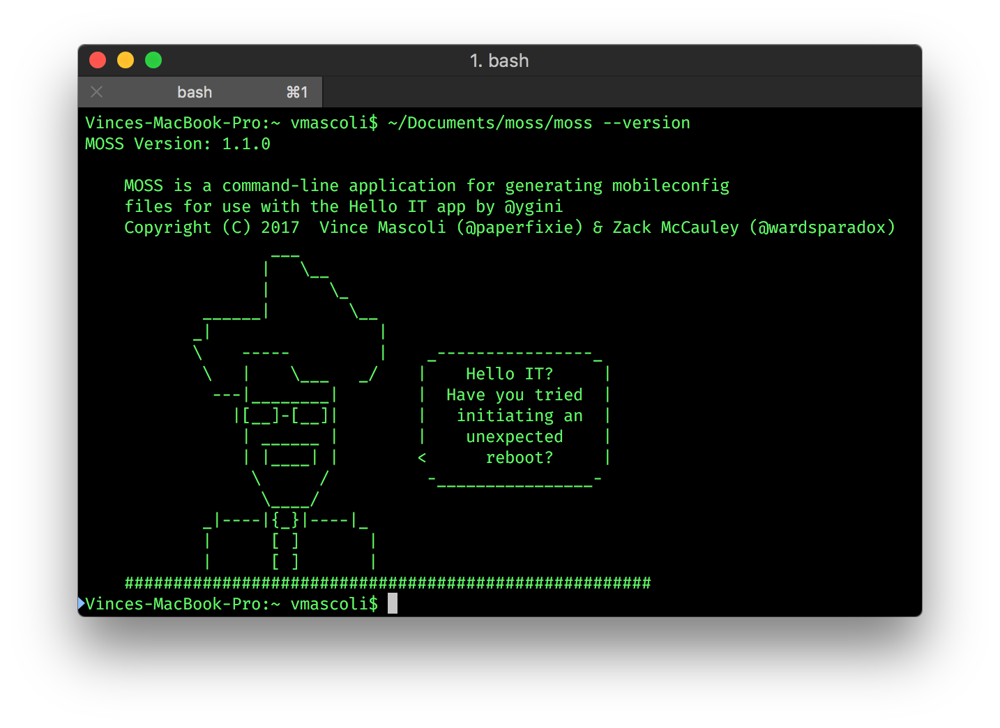](https://github.com/PaperFixie/moss)

### MacDNA

> Customizable menubar that checks for hardware status, management framework status, and other handy information.

**Cost:** N/A

**Link:** [https://github.com/jhbush/Arek/tree/master/Development/MacDNA%20Menulet](https://github.com/jhbush/Arek/tree/master/Development/MacDNA%20Menulet)

[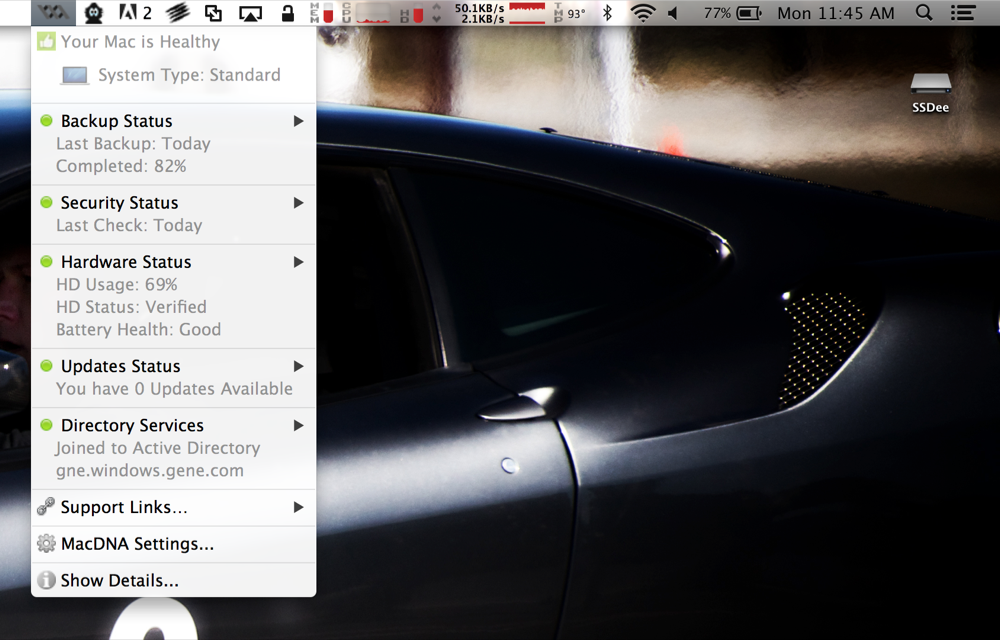](https://github.com/jhbush/Arek/tree/master/Development/MacDNA%20Menulet)

## Text Editing

### Atom

> An free, open source, hackable text editor.

**Cost:** Free

**Link:** [https://atom.io/](https://atom.io/)

[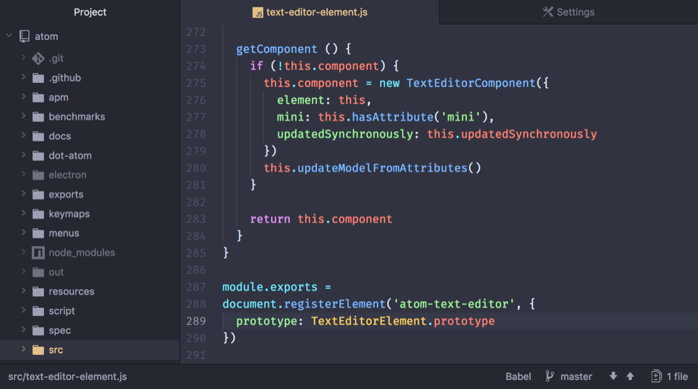](https://atom.io/)

### Sublime Text

> A high performance, cross-platform text editor.

**Cost:** USD $80 to buy, free to evaluate.

**Link:** [https://www.sublimetext.com/](https://www.sublimetext.com/)

[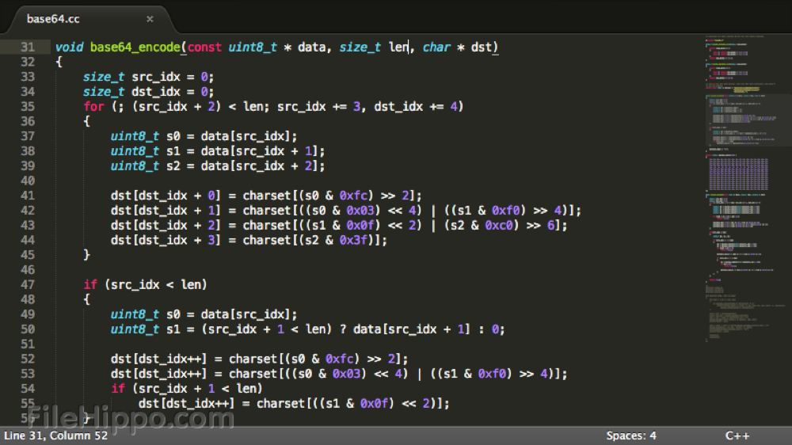](https://www.sublimetext.com/)

### Xcode

> Apple's integrated development environment (IDE) containing a suite of software development tools developed by Apple for developing software used by Apple hardware.

**Cost:** Free with an Apple ID.

**Link:** [https://itunes.apple.com/us/app/xcode/id497799835?mt=12](https://itunes.apple.com/us/app/xcode/id497799835?mt=12)

[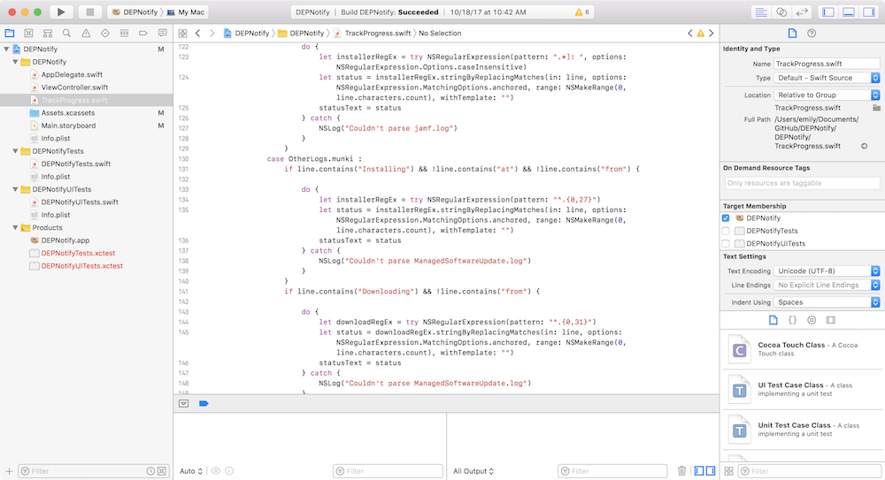](https://itunes.apple.com/us/app/xcode/id497799835?mt=12)

### BBEdit

> Clean and simple HTML & text editor, made by Bare Bones Software.

**Cost:** USD $49.99 (direct download or via Mac App Store)

**Link:** [https://www.barebones.com/products/bbedit/](https://www.barebones.com/products/bbedit/)

[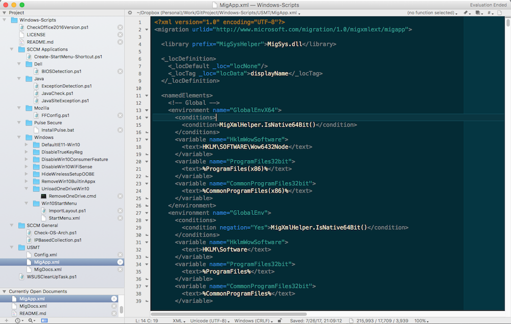](https://www.barebones.com/products/bbedit/)

### MacDown

> An open source markdown editor for macOS.

**Cost:** Free

**Link:** [https://macdown.uranusjr.com/](https://macdown.uranusjr.com/)

[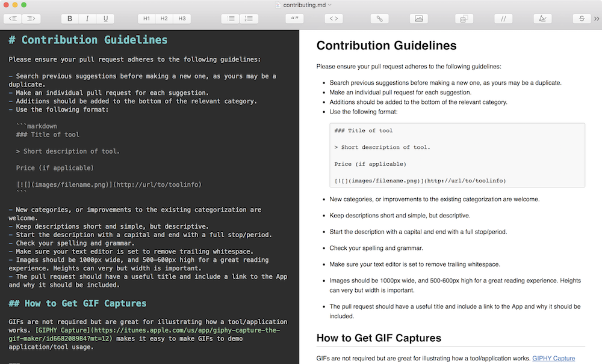](https://macdown.uranusjr.com/)

### Visual Studio Code

> Microsoft's source code editor in a lightweight, open source, cross-platform application.

**Cost:** Free

**Link:** [https://code.visualstudio.com/](https://code.visualstudio.com/)

[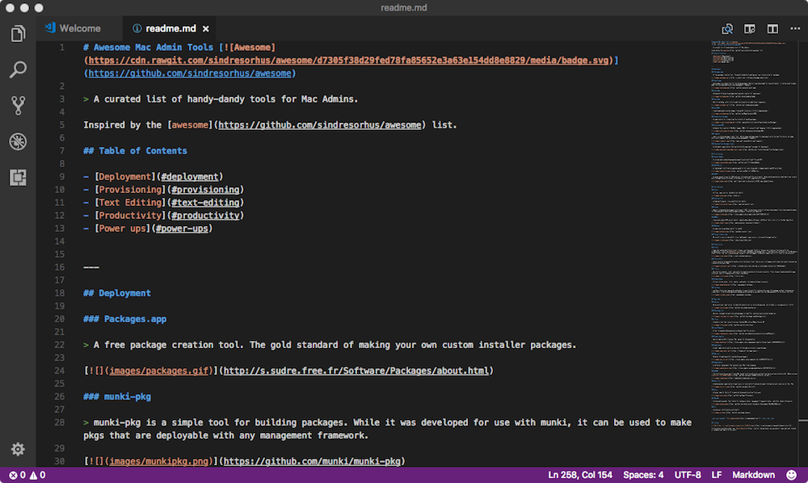](https://code.visualstudio.com/)

## Productivity

### Slack

> Team chat and productivity client. Anyone can create a free team with ten integrations. (Join the [MacAdmins Slack](https://macadmins.herokuapp.com/)!)

**Cost:** Free teams with limited capabilities, additonal pricing can be found [here](https://slack.com/pricing)

**Link:** [https://slack.com/downloads/osx](https://slack.com/downloads/osx)

[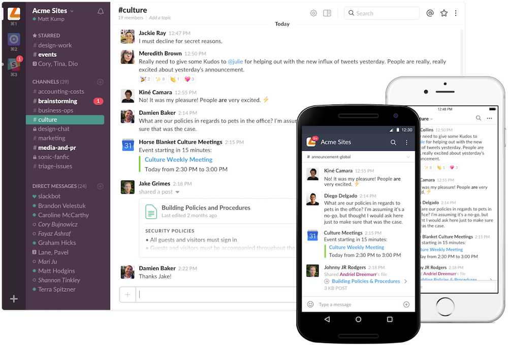](https://slack.com/downloads/osx)

### Trello

> Use Trello's boards, lists, and cards to organize and prioritize your projects. Free, browser-based and mobile app interface.

**Cost:** Free, with paid features available.

**Link:** [https://trello.com/](https://trello.com/)

[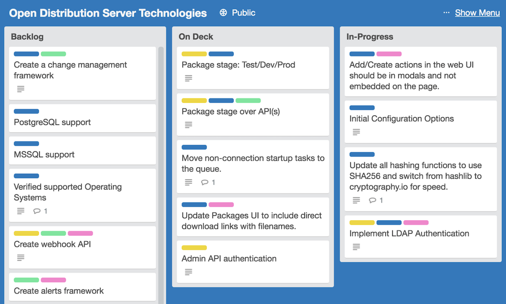](https://trello.com/)

### Google Keep

> Virtual sticky notes, lists, photos, and audio.

**Cost:** Included with Gmail accounts.

**Link:** [https://www.google.com/keep/](https://www.google.com/keep/)

[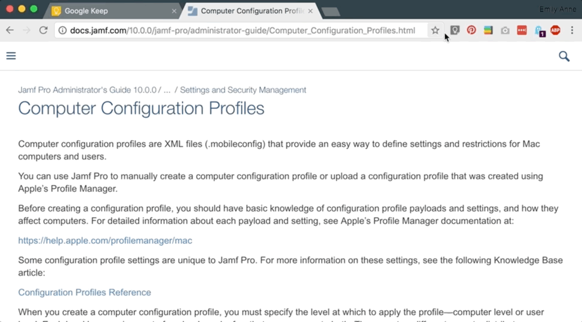](https://www.google.com/keep/)

### LastPass

> LastPass stores your passwords and makes it easy to auto-fill and quickly sign into webapps without retyping your credentials. It also helps generate new passwords and warns you when use the same password for different services.

**Cost:** Free, with paid features available.

**Link:** [https://www.lastpass.com/](https://www.lastpass.com/)

[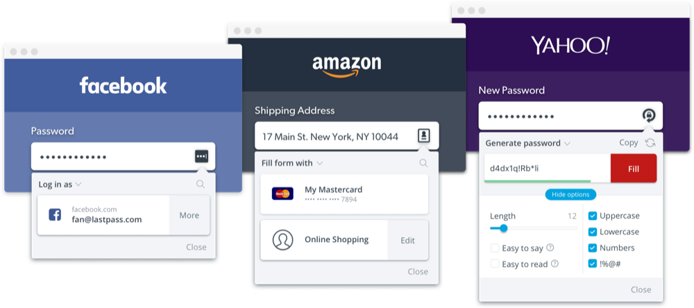](https://www.lastpass.com/)

## Power Ups

### AppCleaner

> A small application which allows you to thoroughly uninstall unwanted apps.

**Cost:** Free

**Link:** [https://freemacsoft.net/appcleaner/](https://freemacsoft.net/appcleaner/)

[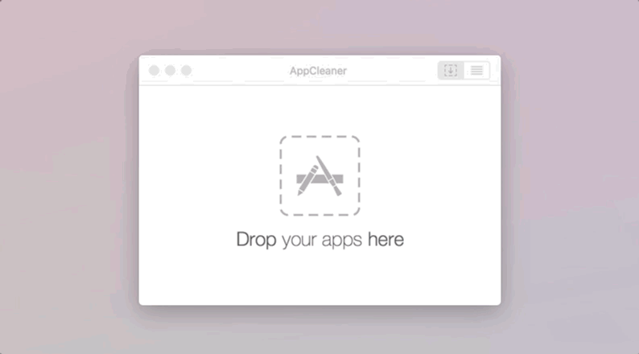](https://freemacsoft.net/appcleaner/)

### Amphetamine

> A caffeine replacement that prevents your Mac from sleeping on demand.

**Cost:** Free in the Mac App Store

**Link:** [https://itunes.apple.com/app/amphetamine/id937984704?mt=12](https://itunes.apple.com/app/amphetamine/id937984704?mt=12)

[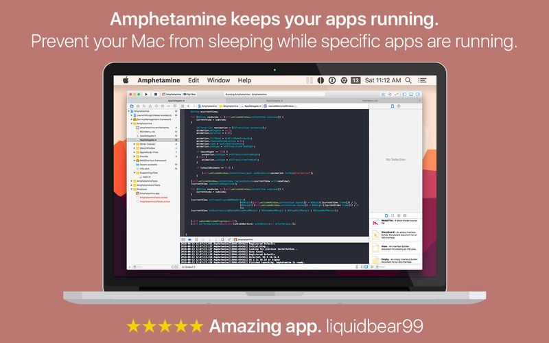](https://itunes.apple.com/app/amphetamine/id937984704?mt=12)

### vfuse

> A handy script that converts a never-booted DMG into a VMware Fusion VM.

**Cost:** N/A

**Link:** [https://github.com/chilcote/vfuse](https://github.com/chilcote/vfuse)

[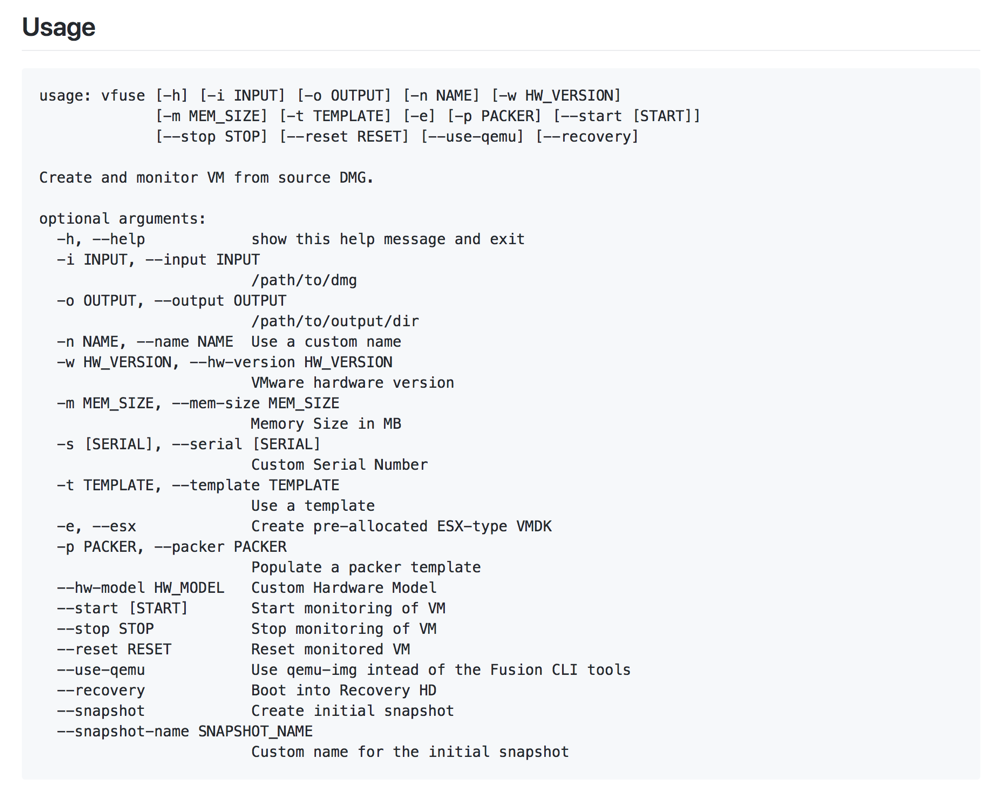](https://github.com/chilcote/vfuse)

### Spruce

> Works with your Jamf server to identify objects not currently being used, out of date, or are generally "crufty".

**Cost:** N/A

**Link:** [https://github.com/sheagcraig/Spruce](https://github.com/sheagcraig/Spruce)

[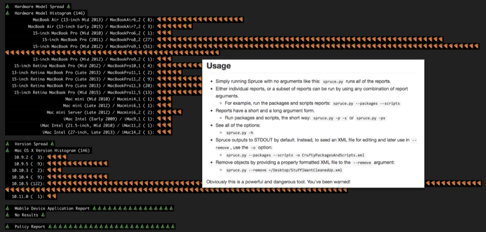](https://github.com/sheagcraig/Spruce)

### Recategorizer

> Quickly recategorize policies and packages in Jamf Pro, and even more unused categories.

**Cost:** N/A

**Link:** [https://github.com/sheagcraig/Recategorizer](https://github.com/sheagcraig/Recategorizer)

[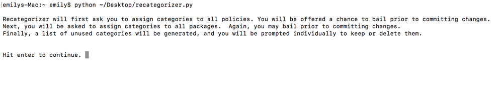](https://github.com/sheagcraig/Recategorizer)

### Yo

> Custom user notifications with Swift.

**Cost:** N/A

**Link:** [https://github.com/sheagcraig/yo](https://github.com/sheagcraig/yo)

[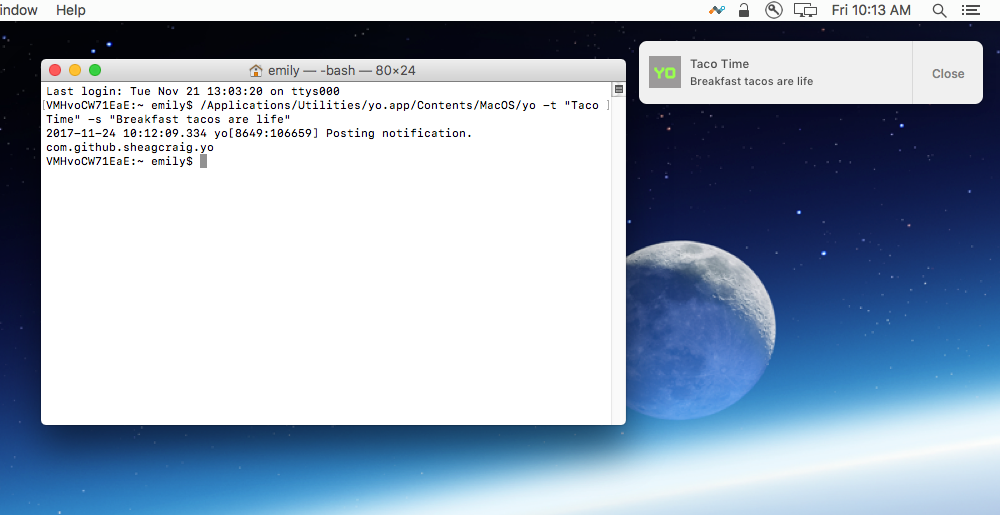](https://github.com/sheagcraig/yo)

### Jamf Migrator

> A tool to migrate data granularly between Jamf Pro servers.

**Cost:** N/A

**Link:** [https://github.com/jamfprofessionalservices/JamfMigrator](https://github.com/jamfprofessionalservices/JamfMigrator)

[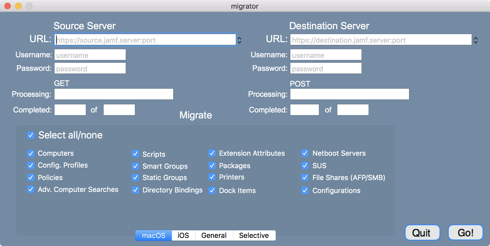](https://github.com/jamfprofessionalservices/JamfMigrator)

### Giphy Capture

> Easily capture GIFs from your Mac, great for documentation.

**Cost:** Free from the Mac App Store.

**Link:** [https://itunes.apple.com/us/app/giphy-capture-the-gif-maker/id668208984?mt=12](https://itunes.apple.com/us/app/giphy-capture-the-gif-maker/id668208984?mt=12)

### Wallcat

> Rotates through beautiful new desktop wallpapers

**Cost:** USD $1.99 in the Mac App Store.

**Link:** [https://itunes.apple.com/us/app/wallcat/id1000397973?mt=12](https://itunes.apple.com/us/app/wallcat/id1000397973?mt=12)

### Stronghold

> Easily configure macOS security settings from the terminal.

**Cost:** N/A

**Link:** [https://github.com/alichtman/stronghold](https://github.com/alichtman/stronghold)

---

## License

To the extent possible under law, [Emily Kausalik](https://twitter.com/emilyooo) has waived all copyright and related or neighboring rights to this work.
